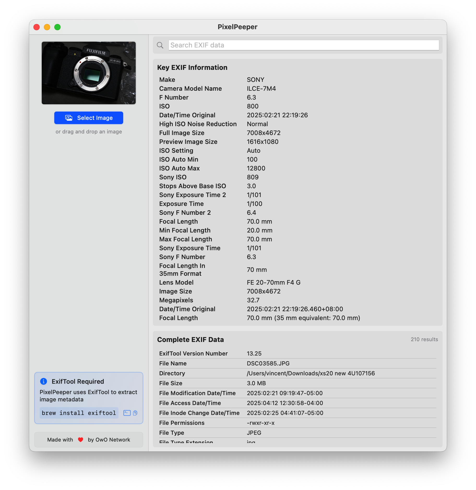

# PixelPeeper

**PixelPeeper** is a lightweight and intuitive macOS app that provides a visual interface for [ExifTool](https://exiftool.org/) — allowing you to quickly inspect the metadata of your photos.

### ✨ Features

- 📸 **Quickly View EXIF Data**: Instantly see essential and commonly used EXIF information like camera model, lens, aperture, shutter speed, ISO, and more.
- 🔍 **Search Metadata**: Easily search for specific tags or fields within the full EXIF data.
- 🧩 **ExifTool-Powered**: Built on the power of `exiftool`, delivering accurate and comprehensive metadata parsing.

### 📸 Screenshots



### ⚙️ Requirements

Before using PixelPeeper, make sure you have `exiftool` installed on your system:

```bash
brew install exiftool
```

> PixelPeeper depends on `exiftool` being available in your system’s PATH.

### 🚀 Getting Started

1. Download and launch PixelPeeper on your Mac.
2. Drag and drop a photo, or open it via the app menu.
3. Instantly browse through important EXIF fields.
4. Use the search bar to locate any metadata field by name.

### 📂 Supported Formats

- JPEG, PNG, HEIC, RAW files (CR2, NEF, ARW, etc.)
- Video formats with embedded metadata (e.g., MP4, MOV)

### 🧠 Why PixelPeeper?

While `exiftool` is powerful, it runs in the terminal and can be overwhelming. PixelPeeper gives you that power in a clean, user-friendly macOS interface — perfect for photographers, developers, and digital forensics professionals alike.
